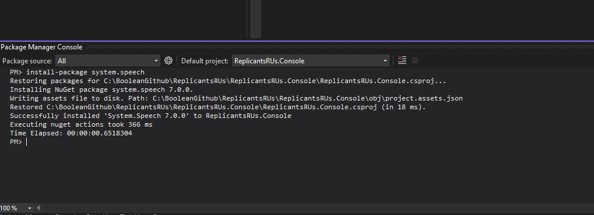

# C# Build Tools - Nuget Package Manager

## Learning Objectives
- to understand projects and solutions in c#
- start exploring namespaces and references
- Reference some other code

## Exercise (for Windows users)

Create a new Console App project in a suitable location 

Make sure that the Project name field says something like <<fakecompanyname>>.Console  and that the Solution name has the <<fakecompanyname>>
In my example I've created ReplicantsRUs for the Solution Name and ReplicantsRUs.Console for the project.

Next open up the Package Manager Console which can be found under Tools - Package Manager - Package Manager Console on the menu in Visual Studio.
Now type the following:  **install-package system.speech**

What will happen now is that nuget should download the relevant dependencies required to install this nuget package.

This is what a successful package install looks like!

Now ensure your **Program.cs** looks like above.

If you now F5 to build and run this, you should hear the hello phrase from your PC.

What has just happened?
Well you've just referenced some other code in a different namespace:  System.Speech.Synthesis 
You don't need to worry how that text to speech code works, just know that someone wrote that code for you and you've just added it to your project.
http://www.nuget.org contains all the packages you can easily add to your project.

By issuing the **uninstall-package system.speech** command you can remove a nuget package from your project.  Note that Visual Studio now doesn't recognise the namespace or object in the class.  You'll have to **install-package system.speech** to make it work again.
